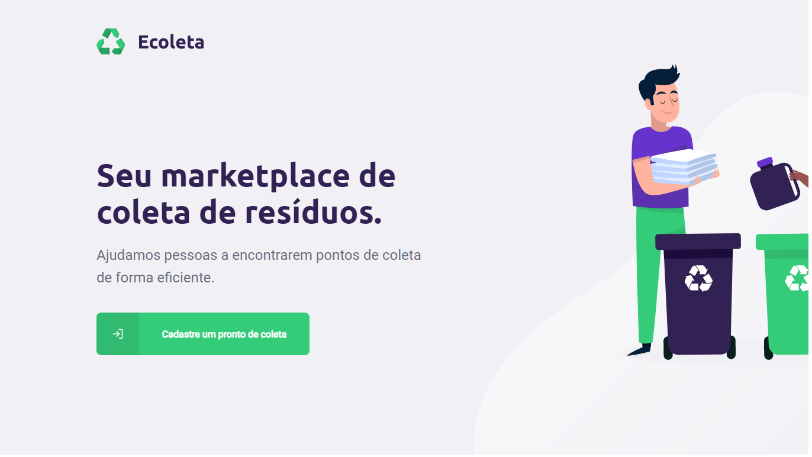

<h3 align="center">
  
   
  <b>Ajute o meio ambiente</b>
</h3>

  
  

# :mag: Sobre

### O Ecoleta é um app do evento Next-Level-Week, que consiste em ajudar o meio ambiente!

> ### O principal objetivo é por em uma aplicação os pontos de coleta de lixo que ficam na cidade assim, um usuario quando quiser reciclar no aplicativo vai mostar o ponto mais proximo e em que esse ponto trabalha reciclagem de oleo, vidro, papelão, etc...

- um ponto de coleta cadastra no site pondo informações da localidade e do que ela trabalha.
- um app no celular mostra esses pontos e o usuario pode alternar entre o que ele quer reciclar.

#

## SERVER :heavy_check_mark:

- feito em nodejs e sustenta tanto a aplicação quanto a mobile
- #### feito com :wrench:
  - Typescript
  - Express
  - Sqlite
  - Knex

## WEB :heavy_check_mark:

- ultilizada apenas para o cadastro do ponto de coleta
- #### feito com :wrench:
  - React
  - Leaflet
  - Axios

  

## MOBILE :heavy_check_mark:

- aqui o usuario podera procurar pelos pontos de coleta pela sua região
- #### feito com :wrench:

  - React-Native/EXPO
  - Template==Typescript
  - React-navigation
  - Axios

  

# Autor

| [ @Ryannnkl](https://github.com/Ryannnkl) |
| :--------------------------------------------------------------------------------------------------------------------------------: |

